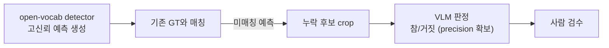

# 02. VLM 모델 선정

> **상태: 확정 (2026-07-27). 공용 모델 = Qwen3.6-35B-A3B NVFP4.**
> 다음 단계는 서빙 가동: [04 1번 첫 가동 절차](04-gpu-pinning-and-serving.md#1-공용-모델-첫-가동-절차)

- 작성: 2026-07-22, 확정: 2026-07-27 (DMT·DST 합의)
- 원본 리서치:
  [모델 랜드스케이프](research/2026-07-22-brief-models.md) ·
  [Qwen3.6 심층 검토](research/2026-07-22-brief-qwen36.md) ·
  [VLM exhaustive detection](research/2026-07-27-brief-vlm-exhaustive-detection.md) ·
  [open-vocab detector 지형도](research/2026-07-27-brief-openvocab-detectors.md)

## 공용 모델 요구사항 (2026-07-27 DMT·DST 합의)

사내 위키 미팅 기록(2026-07-27, URL은 `.env`의 `MEETING_NOTE_URL`)에 따라 모델 1개를 두 용도가 공유한다.

| 팀 | 용도 | 모델에 요구되는 능력 |
|---|---|---|
| DMT | svnet3 추론 결과 시각화 inspection | 고해상 OCR, bbox 검증, structured JSON |
| DST | 라벨링 누락 객체 탐지 (2D, 3D 렌더). Bedrock에서 마이그레이션. 초기 범위 후보: 전방 카메라 한정, TSTLD 리뷰 자동화 | 후보 crop 참/거짓 판정 (judge), 3D 렌더 이미지 해석 |
| 공통 | image + text 입력 agent | tool calling, structured output |

DST 용도에서 모델의 역할 범위(단독 탐지까지 가능한가, 판정 전담인가)는
골든셋 실측(가동 검증 게이트 4번)으로 결정한다. 근거와 판정 기준은
[DST 용도 검토](#dst-용도-검토-라벨-누락-객체-탐지) 참조.

## 확정 구성

| 슬롯 | 구성 | 근거 |
|---|---|---|
| **배치 주력 (확정)** | **Qwen3.6-35B-A3B NVFP4 × DP=N** (레플리카당 5090 1장. N = 몫: 기본 2, 공용 풀은 4) | 유일하게 1장/레플리카 가능한 강후보. 활성 3B + hybrid 소형 KV. TP 후보 대비 처리량 큰 폭 우위 예상 |
| 품질 폴백 | Qwen3.6-27B NVFP4 × DP=N (~15-16GB/장) | 35B-A3B가 종합 추론 게이트에서 미달하면 드롭인 교체. dense라 판정 안정성 상향 |
| 품질 상한 / 2차 검증기 | Qwen3.5-122B-A10B AWQ TP=4 (**4장 풀 합의 하에 단발 실행만**) | 저신뢰 프레임 재검사(escalation) 전용 |
| 비교군 | GLM-4.6V AWQ (bbox 교차검증), Qwen3-VL-32B (베이스라인) | 32B는 처리량 fit 최악 + 문서 성능 동급이라 사실상 강등 |
| 사이드카 (inspection) | PaddleOCR-VL-1.5 (0.9B) | 한국어 간판/HUD 텍스트 추출 → judge 프롬프트에 주입 |
| 사이드카 (라벨 마이닝, 조건부) | LLMDet Swin-L (필요 시 SAM 3 추가) | 가동 검증 게이트 4번에서 VLM 단독 recall 미달 시에만 도입. 배치 잡 한정 로드, VRAM 약 3-6GB |

모델은 확정되었고, 품질 판단은 가동 검증 게이트와 자체 평가셋으로 계속한다
(공개 벤치는 overlay-verification을 다루지 않음).

## 적정 규모 판정

판단 기준: 목적(inspection + 라벨 마이닝 판정 + agent) 정합, dst+dmt 풀(5090 4장, 128GB) 감당 가능,
과하지 않음, 부족하지 않음.

| 구성 | GPU 점유 (4장 풀 기준) | 판정 |
|---|---|---|
| **Qwen3.6-35B-A3B NVFP4** | 가중치 **23.25GiB 실측**(순수 NVFP4가 아닌 MIXED_PRECISION 체크포인트라 추정치 20GB보다 크다), 1장/레플리카. DP=1-4 탄력 운영 | **적정.** 세 용도 전부 커버, 레플리카 수로 규모 조절 가능, 풀 독점 없음. 인식 품질은 vision encoder가 dense라 27B와 동급 |
| Qwen3.6-27B NVFP4 | 약 16GB, 1장/레플리카 | 적정 대안. 종합 추론 품질 상향, 처리량 하향. 게이트 4b 미달 시 교체 |
| Qwen3.5-122B-A10B AWQ | TP=4, 풀 전체 독점 | 상시 운영은 과함. 다른 실험 공존 불가. 저신뢰 건 에스컬레이션 단발 실행만 |
| GLM-4.6V AWQ | TP=2 이상 (가중치 약 55-60GB) | 과함 + 서빙 리스크 (아래 Agentic 축). 비교군만 |
| Qwen3-VL-8B FP8 | 약 10GB, 1장 | 최종 모델로는 부족 (판정 품질). 파이프라인 bring-up 전용 |
| 사이드카 detector | 배치 잡 한정 로드, 3-6GB | 조건부. 게이트 4a 미달 시에만 도입, 상시 서빙 아님 |

## 선정 기준

- 4× RTX 5090 = 실사용 VRAM ~122GB (카드당 ~30.5GB)
- 미세 오버레이 텍스트/숫자 판독 → native/dynamic resolution 필수. 이미지당 토큰 캡 있는 모델 탈락
- 검출 정합성 추론 (miss/FP/misalign) → grounding + thinking
- structured JSON 신뢰성, 한국어 OCR, 상업 라이선스, vLLM/SGLang 지원, 양자화 체크포인트
- **P2P 없는 PCIe 박스 → "1장/레플리카 가능"이 처리량의 결정 변수** (활성 파라미터 작은 MoE 유리)
- (2026-07-27 추가) DST 겸용 축: crop 판정 정확도, vLLM tool calling 신뢰성, 3D 렌더 이미지 해석.
  exhaustive detection 원시 성능은 선정 축이 아님 (사이드카 detector가 전담 가능, 아래 DST 용도 검토)

## Qwen3.6 계열 선정 근거

### 아키텍처

- 두 모델 모두 **hybrid GDN(Gated DeltaNet) + full attention ¼ 레이어** (Qwen3-Next 계보, vLLM `qwen3_5_moe` 경로).
  KV 캐시가 레이어 ¼에만 존재 → 긴 vision prefill + shared few-shot prefix 배치와 이상적 궁합.
- **vision encoder(ViT + DeepStack)는 dense (MoE로 희소화되지 않음).**
  작은 숫자/한글 판독은 27B와 35B-A3B가 사실상 동일. 활성 3B 한계는 화면 전체 종합 추론에서만.
- 이미지 토큰 수식 동일: `tokens = H×W/1024 + 2`.
  기본 `max_pixels` 7.84M. 작은 오버레이 숫자 판독에는 **9-10M로 상향 필수**.
- bbox 좌표 규약은 자료 간 상충 (절대 픽셀 vs 0-1000 정규화 보고 혼재).
  리사이즈 정책과 좌표 역변환을 가동 검증 게이트 3번에서 실측 확인.

### 벤치마크 (공식 카드 기준, ±1-2pt)

문서/OCR/grounding 축에서 **3.6-27B ≈ 3.6-35B-A3B ≈ 3.5-122B-A10B 사실상 동률**:

| 축 | 3.6-27B | 3.6-35B-A3B | 3.5-122B-A10B |
|---|---|---|---|
| OmniDocBench 1.5 | ~90 | 89.9 | 90.8 |
| OCRBench | **89.4** | (CC-OCR 81.9) | 없음 |
| RefCOCO (grounding) | **92.5** | 92.0 | 없음 |
| MMMU | 82.9 | 81.7 | ~83.9-85.0 |

122B 우위는 MMMU급 추론 몇 점뿐이며 이 워크로드의 핵심 축이 아님.
한국어는 Qwen OCR core-10 언어라 커버 양호 (오버레이 폰트는 스팟체크).

### 가동 검증 게이트 (서빙 직후 실측, 5항목)

| 번호 | 게이트 | 방법 | 실패 시 |
|---|---|---|---|
| 1 | NVFP4의 OCR 정확도 | 자체 4464x2160 프레임에서 BF16/FP8 대비 비교 | FP8 또는 27B로 전환 |
| 2 | Mamba prefix caching 실동작 | GDN 레이어 prefix 캐시가 align mode experimental. 히트율 로그 확인 | 캐시 OFF 전제로 처리량 재산정 |
| 3 | bbox 좌표 규약 + 리사이즈 역변환 | 좌표 왕복 테스트 (그린 박스를 원본 좌표로 복원해 IoU 확인) | 전처리에서 고정 해상도 강제 |
| 4 | DST 골든셋 실측 | 누락 라벨을 아는 프레임 50-100장에서 (a) VLM 단독 마이닝 recall, (b) 후보 crop 참/거짓 판정 정밀도 측정 | (a) 미달 시 사이드카 detector 도입, (b) 미달 시 27B 승격 또는 122B 에스컬레이션 |
| 5 | vision + tool calling 동시 동작 | vLLM `--tool-call-parser qwen3_coder`로 이미지 입력 + tool call 왕복 | 파서 교체 (qwen3_xml) 후 재시도 |

실측 현황 (2026-07-30, DP=2 가동 후):

| 게이트 | 상태 | 실측 내용 |
|---|---|---|
| 1 NVFP4 OCR | **미실측** | 합성 오버레이(1280x720)는 정상 판독. BF16/FP8 대비 비교는 아직 |
| 2 prefix caching | **완료 — 비활성 확정** | `enable_prefix_caching=False` 자동 선택. `vllm:prefix_cache_queries_total` = 0 고정, 엔진 로그 `Prefix cache hit rate: 0.0%`. → 처리량 재산정 필요, 캐시 인지 라우팅(sglang_router 등) 무의미 |
| 3 bbox 좌표 규약 | 미실측 | |
| 4 DST 골든셋 | 미실측 | DST 라벨 데이터 대기 |
| 5 vision + tool | 미실측 | 절차는 [examples/curl.md 5번](../examples/curl.md) 에 준비됨 |

가동 후 확정된 서빙 용량 (레플리카 1개 = GPU 1장):

| 항목 | 실측 |
|---|---|
| KV 캐시 | **3.14 GiB = 270,767 tokens** |
| 최대 동시성 | 32,768 토큰 요청 기준 **8.26x** (`--max-num-seqs 16` 보다 작다 → 긴 요청이 몰리면 preemption) |
| VRAM 사용 | 29.85 / 32.6 GiB (`--gpu-memory-utilization 0.95`) |
| 이미지 상한 실제 | 4464x2160 프레임은 9.4K 토큰 → `--max-model-len 32768` 에 **최대 3장**. `--limit-mm-per-prompt {"image": 4}` 는 다운스케일/크롭 전제 |

부하 실측으로 확인된 실제 병목은 KV 가 아니다 ([09](09-stress-test-results.md)).
동시 64까지 밀어도 KV 사용률은 최대 64퍼센트, preemption 은 0이었다. `running` 이
`--max-num-seqs 16` × 레플리카 2 = 32 에서 멈추고 초과분이 전부 큐로 쌓인다.
"최대 동시성 8.26x" 는 32K 컨텍스트를 꽉 채운 요청 기준이며, 실제 요청(1K-10K 토큰)에는
과하게 보수적인 수치다. 따라서 `--max-num-seqs` 상향이 다음 A/B 1순위다.

## Qwen3.6 서빙 노트

- **NVFP4 체크포인트**: unsloth 35B-A3B-NVFP4 + NVIDIA 공식, 27B 커뮤니티
  (5090 + CUDA 13.2 + vLLM 0.20.2 동작 확인). BF16 대비 noise 수준 주장.
  SM120에선 AWQ보다 **NVFP4가 4bit 정석**. FP8은 35B가 1장에 안 들어가므로 배치 목적에는 비추천.
- vLLM **0.20.2+ (cu130)** 권장, FlashInfer (시스템 CUDA 13 toolkit 필요).
  **가동 실측: `vllm/vllm-openai:v0.24.0` 파생 이미지로 운영 중** (`docker/Dockerfile`).
  0.24.0 은 FLASHINFER_CUTLASS NvFp4 MoE 백엔드를 자동 선택하므로 관련 env 플래그를 넣지 않아도 된다.
- **Hybrid 주의 3종** (실제 보고된 문제):
  1. Mamba cache 블록 한정 → `--max-num-seqs` 캡 필수 (16-32 시작)
  2. prefix caching이 GDN 레이어에서 experimental → 실동작 검증
  3. CUDA graph 캡처 OOM → `--max-cudagraph-capture-size` 하향
- **Spec decode**: MTP 내장 (accept ~3.19, n=3)이지만 고동시성 처리량 퇴행 → **배치는 OFF**.
  동시성 유지 가속은 **DFlash** (2.3-2.5×, 공개 체크포인트). EAGLE-3는 내장 MTP 대비 열위.
- thinking 기본 ON → **배치는 non-thinking** (`enable_thinking=False`), 에스컬레이션 패스만 thinking.
- **Tool calling**: vLLM 공식 recipe 존재.
  `--reasoning-parser qwen3 --tool-call-parser qwen3_coder --enable-auto-tool-choice`.
  5090 NVFP4 단일 카드 실측 105-160 tok/s 보고.

## DST 용도 검토: 라벨 누락 객체 탐지

원본: [VLM exhaustive detection 브리프](research/2026-07-27-brief-vlm-exhaustive-detection.md) ·
[open-vocab detector 브리프](research/2026-07-27-brief-openvocab-detectors.md)

### VLM 단독 운용 가능성: 실측으로 판정

"이미지에서 라벨 안 붙은 객체를 전부 찾기"는 exhaustive detection이며,
공개 벤치마크는 생성형 VLM의 약점으로 지목한다.

| 위험 신호 | 근거 |
|---|---|
| 고밀도 장면 recall 붕괴 | HoloCount(2026-07): 고밀도 subset에서 exact match 0-20%, 체계적 과소 계수 |
| 소형 객체 미검출 | GroundingME: 최상위 235B 모델도 Acc@0.5 45.1%, IoU 0.75 이상에서 급락 |
| 없는 객체 hallucination | 존재하지 않는 대상 rejection 대부분 모델 0% |
| 도메인 밖 성능 | RF100-VL zero-shot에서 생성형 VLM은 특화 detector 대비 큰 폭 열세 |

단 위 수치는 벤치마크 조건의 결과이며 우리 데이터에 대한 직접 증거가 아니다. 반대 방향 근거:

- 주행 핵심 클래스(차량, 보행자, 신호등, 표지판)는 COCO/Objects365 head class로 VLM 학습 분포 안
- RF100-VL의 붕괴 사례는 의료/항공 등 분포 밖 도메인에 집중
- 일반 밀도 counting은 우수 (Qwen3.5-27B가 CountBench 1위, 0.978)

운영 원칙: 시스템을 최소로 유지하기 위해 **VLM 단독으로 시작**하고,
골든셋 recall 실측(가동 검증 게이트 4번)이 미달하는 경우에만 아래 2단 구조를 도입한다.

### 게이트 미달 시 도입안: detector 마이닝 + VLM 판정

2026년 업계 표준은 2단 구조다 (FiftyOne `compute_mistakenness` 패턴).
사이드카 detector는 상시 서빙이 아니라 마이닝 배치 잡에서만 로드하므로 GPU 추가 점유가 없다.

사람 검수를 유지하는 이유: 최고 기법도 라벨 오류의 최대 66%를 놓친다는 보고가 있다 (Rechecked 벤치마크).
이 구조에서 공용 VLM에 요구되는 능력은 crop 판정 정확도이며, 이는 Qwen3.6 계열의 강점 영역이다.

### 사이드카 detector 후보 (로컬 배포 + 상용 라이선스)

| 모델 | LVIS zero-shot | VRAM | 라이선스 | 역할 |
|---|---|---|---|---|
| **LLMDet Swin-L** | **51.1 AP (rare 45.1)** | 약 3-5GB | Apache 2.0 | 주 마이너. 로컬 배포 가능 detector 중 최고 정확도, transformers 통합 |
| **SAM 3** | 48.8 mask AP | 약 3-6GB | SAM License (상용 허용) | 보완 마이너. concept prompt(텍스트 + 이미지 exemplar)로 해당 개념 전 인스턴스 검출 |
| OWLv2 | rare 44.6 APr | 약 4-6GB | Apache 2.0 | 희귀 클래스 recall 보조 (느림) |
| YOLOE26-L | 36.8 AP | 약 2-4GB | AGPL-3.0 (법무 확인 필요) | 대량 스캔용 초고속 |

탈락: DINO-X, Grounding DINO 1.5/1.6 Pro, T-Rex2, Rex-Omni.
절대 성능은 최상위(LVIS 57-60 AP)이나 전부 API 전용 또는 비상업 라이선스로 로컬 상용 배포 불가.

배포 주의 2가지:

1. detector는 HF transformers 포팅 버전 사용. mmcv 네이티브 빌드는 SM120에서 실패 사례 다수
2. 사이드카 합산 VRAM 약 6GB로 VLM 레플리카와 같은 GPU에 동거 가능

### 3D 렌더 이미지 처리

- open-vocab 3D detector는 연구 단계로 미성숙. 표준은 **2D 마이닝 + 기존 3D 라벨의 2D 투영 + frustum lifting**
- 오브젝트 수준 판정("이 렌더에 라벨 없는 객체가 보이는가")은 점군 렌더 이미지로 충분히 동작한다는 근거 있음.
  단 거리/크기 등 기하 추정은 신뢰 불가, 존재 여부 판단까지만
- 희소 점군 원본 렌더는 인식률이 낮으므로 프레임 누적(densification) 후 렌더 권장

## Agentic 축: tool calling 비교

최종 목표(image + text 입력 agent) 기준 비교.

| 항목 | Qwen3.6 계열 | GLM-4.6V |
|---|---|---|
| vLLM tool calling | 공식 recipe, 파서 안정 | vision + tool calling 동시 사용 파서 이슈 이력 (vLLM #31485), 해소 여부 불명확 |
| 설계 | 표준 OpenAI-compatible | native multimodal tool use (개념상 최적) |
| agent 벤치마크 | 35B-A3B: SWE-bench 73.4 / 27B: SWE-bench 77.2, AndroidWorld 70.3 | BFCL 직접 수치 미공개 |
| GPU 점유 | 1장/레플리카 | 4bit 가중치 약 55-60GB, TP 2장 이상 필수 |

결론: 모델 능력 차이보다 서빙 스택 성숙도 차이가 실질 변수이며, 두 축 모두 Qwen3.6이 우위.
GLM-4.6V는 공용 단일 모델 후보에서 제외하고 bbox 교차검증 비교군으로만 유지한다.

## GPU 몫별 영향: 기본 2장, 병합 풀

확정 분배: **dst+dmt 공용 4장 / vpt 2장 / dpt 2장** ([05 분배표](05-strad32-team-resource-split.md)).

| 몫 | 배치 주력 (35B-A3B NVFP4) | 122B 2차 검증기 | 비고 |
|---|---|---|---|
| 2장 (vpt/dpt형 단독) | DP=2 | **불가** (TP=2 64GB는 AWQ 가중치 ~65GB만으로 초과) | 검증기 대안 필수 (아래). 배치+QA는 한 엔진 priority 동거 |
| 4장 (dst+dmt 공용 풀) | DP=4 (같은 모델이므로 인스턴스 자체를 두 팀이 공유) | TP=4 가능 (풀 합의 하에) | sleep mode·priority scheduling 실용도 최상 |

핵심: **주력 구성(1장/레플리카 DP)은 몫과 무관하게 강건하며 레플리카 수만 조정.**
깨지는 것은 122B 검증기(4장 필요)뿐이다.

2장 단독 운영 시 122B 검증기 대안:

1. 2차 검증기를 Qwen3.6-27B (thinking ON)로 승격 (가장 단순)
2. GLM-4.6V-Flash 9B를 bbox 교차검증기로
3. 122B가 꼭 필요하면 병합 풀(4장+) 시간을 빌려 단발 실행 (상시 아님)

## 후보 전체 비교 (1차 리서치, 2026-07-22)

| 모델 | 크기(활성) | 4bit 무게 | 라이선스 | 강점 | 약점 |
|---|---|---|---|---|---|
| Qwen3.6-35B-A3B | 35B(3B) | ~19-20GB | Apache 2.0 | 1장/레플리카, hybrid KV, MTP/DFlash | hybrid 경로 신생 |
| Qwen3.6-27B | 27B dense | ~15-16GB | Apache 2.0 | 패밀리 최강 OCR/grounding | dense라 A3B보다 느림 |
| Qwen3.5-122B-A10B | 122B(10B) | ~65GB | Apache 2.0 | 품질 상한, OCRBench 92.1 | TP=4 필요, quant 생태계 미성숙 |
| GLM-4.6V | ~107B(12B) | ~55GB | **MIT** | normalized bbox 직접 출력, function calling | 한국어 OCR 약함, ~4K px 한계, vLLM 파서 이슈 |
| Qwen3-VL-32B | 33B dense | ~18GB | Apache 2.0 | 가장 검증된 운영 경로, quant 전부 존재 | 처리량 fit 최악 (full-attn dense) |

## 탈락 사유 기록

| 모델 | 사유 |
|---|---|
| Qwen3-VL-235B-A22B, InternVL3.5-241B | 4bit 가중치만으로 가용 VRAM 소진 (KV 공간 없음) |
| Qwen3.5-397B, Kimi K2.5/2.6 (1T), GLM-5V-Turbo (744B) | 크기 불가 |
| GPT-OSS 계열 (2026-07-27 미팅에서 언급) | 텍스트 전용, vision 입력 없음. VLM 용도 부적합 |
| Gemma 4 31B | 이미지당 1120 토큰 캡. 4.4K 폭 미세 텍스트 판독 불가 |
| Llama 4 Scout/Maverick | OCR/문서 이해 열세, 라이선스 부담 |
| Pixtral | 라인 종료 (Mistral Small 4로 흡수) |
| InternVL3.5-38B | 448px 타일 ~50장이 학습 범위(36) 초과, 한국어 약함 |
| GLM-4.6V (2026-07-27) | vLLM vision+tool calling 동시 사용 파서 이슈 이력 + TP 2장 이상 점유. 비교군으로만 유지 |

## 단일 GPU 폴백 (빠른 실험용)

| 모델 | VRAM | 용도 |
|---|---|---|
| Qwen3-VL-8B-Instruct-FP8 | ~10GB | 파이프라인 bring-up, 프롬프트/스키마 반복 |
| GLM-4.6V-Flash 9B | ~10GB | GLM 계열 grounding/function-calling 미리보기 |
| Ovis2.6-30B-A3B (4bit) | ~16GB | NaViT native res 잠재 후보 |

## 보조 모델

- **PaddleOCR-VL-1.5 (0.9B)**: 한국어 문서 OCR 최강 (MDPBench 86.0). vLLM 지원
- **Molmo 2-8B**: pointing/counting 최강, 독립 2차 의견용.
  학습 데이터 비상업 이슈 있음. 법무 검토 후 사용
- **VARCO-VISION-2.0-14B** (NCSOFT): 한국어 특화 + 텍스트 bbox.
  한국어가 판정에 중요해지면 테스트 (라이선스 조항 확인)

## 검토 이력

- **2026-07-22 (1차)**: Qwen3.5-122B-A10B AWQ TP=4를 1순위, GLM-4.6V 2순위, Qwen3-VL-32B를 안전 후보로 결론.
- **2026-07-22 (2차, 당일)**: Qwen3.6 심층 검토 반영.
  "1장/레플리카 DP=4" 가능성 + 문서/OCR 축 동률 확인으로 처리량 축 승자가 Qwen3.6-35B-A3B로 교체.
  122B는 품질 상한/2차 검증기로 재배치.
- **2026-07-27 (3차)**: DMT·DST 공용 요구사항 반영 (미팅 합의).
  DST 라벨 마이닝 축과 agentic 축 추가 검토. 신규 릴리스 없음 확인 (07-22 이후).
  결론 유지: Qwen3.6-35B-A3B NVFP4가 공용 모델 1순위.
  GLM-4.6V는 vLLM vision+tool calling 파서 이슈와 GPU 점유(TP 2장 이상)로 후보 제외, 비교군 강등.
  라벨 마이닝은 VLM 단독 시작, 골든셋 recall 미달 시에만 detector 사이드카(LLMDet 등) 도입.
- **2026-07-27 (확정)**: DMT·DST 합의로 Qwen3.6-35B-A3B NVFP4 확정.
  첫 단계는 서빙 가동과 가동 검증 게이트 5항목 실측 ([04 1번](04-gpu-pinning-and-serving.md#1-공용-모델-첫-가동-절차)).
