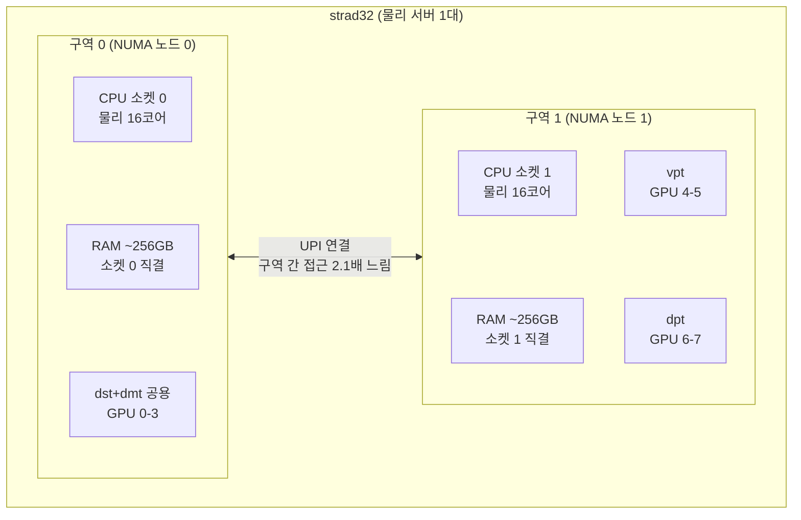

# 05. [운영 안내] strad32 자원 분할

> **상태: 적용·검증 완료. 미결 사항 없음.**

- 서버: strad32 (IP는 `.env`의 `STRAD32_IP`, git 미포함), RTX 5090 32GB x 8, RAM 512GB, 물리 서버 1대

## 1. 분할 전략

### 몫과 배정

| 몫 | 계정 | GPU | CPU (물리) | NUMA 구역 | RAM 상한 | 데이터 공간 |
|---|---|---|---|---|---|---|
| dst+dmt 공용 | dst, dmt | 0-3 | 0-15,32-47 (16코어) | 0 | 225G | /data01/dst, /data01/dmt |
| vpt | vpt | 4-5 | 16-23,48-55 (8코어) | 1 | 112G | /data01/vpt |
| dpt | dpt | 6-7 | 24-31,56-63 (8코어) | 1 | 112G | /data01/dpt |

### 설계 원칙

1. **NUMA 정렬.** 각 몫의 CPU와 RAM은 해당 GPU가 직결된 구역 안으로 묶는다.
   구역을 건너는 메모리 접근은 구역 내 대비 2.1배 느리기 때문이다.
2. **최소 설정.** 서버 전체를 마비시키는 사고 유형(한 몫의 RAM 폭주)만 커널 수준에서 차단하고,
   GPU는 배정표 기반 관례로 운영한다. 추가 방어 수단은 사고가 실제로 발생한 경우에만 도입한다.
3. **dst+dmt 공용 몫.** 두 팀은 방향성이 같아 처음부터 하나의 몫으로 운영한다.
   공용 몫 내부에 격리는 없으며, 필요해지면 분리 절차([4번](#4-변경사고-시-절차))를 적용한다.

### 서버 구조

서버는 1대이나 CPU 소켓이 2개이므로 내부가 두 구역(NUMA 노드)으로 나뉜다.
구역 수는 하드웨어 구조이며 팀 수와 무관하다.



### 실측 스펙

| 항목 | 값 |
|---|---|
| CPU | Intel Xeon Gold 6444Y x 2 (소켓당 16코어/32스레드, base 3.6GHz) |
| RAM | 512GB (구역당 ~252GiB), swap 비활성 |
| GPU | RTX 5090 32GB x 8, 전 카드 PCIe Gen5 x16, 드라이버 580.159.03 |
| 디스크 | / 11TB, /data01 22TB (팀별 데이터·모델 저장소) |

## 2. 사용 방법

### 접속

```bash
ssh <팀계정>@${STRAD32_IP}     # dst / dmt / vpt / dpt, IP와 비밀번호는 별도 공유
```

최초 접속 시 `passwd` 명령으로 팀 비밀번호를 변경하는 것을 권장한다.

### 로그인 시 자동 적용되는 항목

| 항목 | 내용 | 강제 수준 |
|---|---|---|
| GPU 지정 | `CUDA_VISIBLE_DEVICES`가 몫에 맞게 설정된다. CUDA 앱(PyTorch, vLLM)은 배정된 GPU만 인식한다 | 관례 (환경변수) |
| CPU 범위 | 배정된 코어에서만 실행된다 | 커널 강제 (cgroup) |
| RAM 상한 | 초과 시 해당 몫의 프로세스만 종료된다. 서버와 타 팀은 영향받지 않는다 | 커널 강제 (cgroup) |
| 모델 캐시 | `HF_HOME=/data01/<계정>/hf-cache` | 환경변수 |

참고: `nvidia-smi`에는 GPU 8장이 모두 표시된다. 드라이버 수준 도구라 정상 동작이며,
격리는 CUDA 앱 수준에서 적용된다.

### 도커 사용 시

컨테이너는 계정 수준 제한의 바깥에 있으므로, 실행 시 몫을 플래그로 직접 지정한다.

```bash
docker run --gpus '"device=<배정 GPU UUID>"' \
  --cpuset-cpus="<배정 CPU 범위>" --cpuset-mems="<배정 구역>" \
  --memory=<RAM 상한> --memory-swap=<RAM 상한> --shm-size=32g ...
```

### 공유 자원 규칙

| 자원 | 규칙 |
|---|---|
| GPU 전력 | 전 카드 450W 캡 적용됨. 부팅 시 자동 적용(`gpu-power-cap.service`). 8장 전부하 시 벽전력 4kW 초과 대비이며, 추론 성능 영향은 한 자릿수 수준 |
| 포트 | dst+dmt 8xxx / vpt 9xxx / dpt 10xxx |
| 디스크 | 대용량 파일은 `/data01/<계정>/` 아래 사용(22TB). 반입은 사전 공지 |
| 타 팀 GPU | 사용 금지 (배정표 준수) |

## 3. 검증 결과

전 항목 통과. 재검증 명령은 [4번](#4-변경사고-시-절차)에 있다.

| 항목 | 방법 | 결과 |
|---|---|---|
| CPU 격리 (4팀) | 팀 slice 내부에서 `taskset` 조회 | 각 몫의 코어 범위만 허용 |
| NUMA 바인딩 (4팀) | `Mems_allowed_list` 조회 | dst/dmt는 구역 0, vpt/dpt는 구역 1만 허용 |
| RAM 캡: 메커니즘 | 1G 캡 스코프에 2G 할당 | 해당 프로세스만 SIGKILL(종료코드 137), 서버 무영향 |
| RAM 캡: 실운영 값 | vpt slice(112G 캡)에 160G 할당 시도 | 108G까지 할당된 후 112G 경계에서 SIGKILL. 서버 무영향, 메모리 전액 회수 |
| CUDA 격리 (4팀) | libcuda 직접 호출로 인식 GPU 수 조회 | dst/dmt 4장, vpt/dpt 2장만 인식 |
| GPU 전력 캡 | 설정 후 전 카드 조회 | 8장 전부 450.00W |
| /data01 권한 (4팀) | 계정별 쓰기 테스트 | 각자 디렉토리 쓰기 가능 (750 권한) |
| 재부팅 생존 | 재부팅 후 재점검 | slice 설정·환경변수 유지 |
| 서버 전반 | `scripts/healthcheck.sh` | 12항목 전체 통과 (드라이버 일치, GPU 8장 Gen5 x16 등) |

검증 과정에서 발견하여 수정한 문제 1건:

> 환경변수를 `.bashrc` 하단에 두면 비인터랙티브 셸(`ssh 계정@서버 '명령'`, nohup 등)에서
> 적용되지 않는다. Ubuntu 기본 `.bashrc` 상단의 인터랙티브 가드가 먼저 return하기 때문이다.
> 환경변수 블록을 **`.bashrc` 최상단**으로 이동하여 해결했다.

## 4. 변경·사고 시 절차

### dst+dmt 내부 분리 (팀 간 간섭이 문제가 될 때)

```bash
sudo systemctl set-property user-$(id -u dst).slice AllowedCPUs=0-7,32-39  AllowedMemoryNodes=0 MemoryMax=112G MemorySwapMax=0
sudo systemctl set-property user-$(id -u dmt).slice AllowedCPUs=8-15,40-47 AllowedMemoryNodes=0 MemoryMax=112G MemorySwapMax=0
```

GPU 배정은 dst 0-1 / dmt 2-3으로 나눈다 (각 계정 `.bashrc`의 `CUDA_VISIBLE_DEVICES` 수정).
적용 후 두 팀의 프로세스 재시작이 필요하다.

### 계정 추가·재구축

```bash
# 1) 계정 생성과 비밀번호 설정
sudo adduser --disabled-password --gecos "" <계정> && sudo passwd <계정>

# 2) 환경변수 등록 - 반드시 .bashrc "최상단"에 둘 것 (3번의 발견 문제 참조)
#    export CUDA_DEVICE_ORDER=PCI_BUS_ID
#    export CUDA_VISIBLE_DEVICES=<배정 GPU>
#    export HF_HOME=/data01/<계정>/hf-cache

# 3) 자원 제한 (영구 저장되며 재부팅 후에도 유지)
sudo systemctl set-property user-$(id -u <계정>).slice \
  AllowedCPUs=<범위> AllowedMemoryNodes=<구역> MemoryMax=<상한> MemorySwapMax=0

# 4) 데이터 공간
sudo mkdir -p /data01/<계정> && sudo chown <계정>:<계정> /data01/<계정> && sudo chmod 750 /data01/<계정>
```

### 자원 격리 재검증

```bash
# CPU/NUMA 확인
sudo systemd-run --uid=$(id -u vpt) --slice=user-$(id -u vpt).slice --scope --collect \
  bash -c 'taskset -cp $$; grep Mems_allowed_list /proc/self/status'

# RAM 캡 동작 확인: 1G 캡에 2G 할당. 종료코드 137이면 정상
sudo systemd-run --uid=$(id -u vpt) --slice=user-$(id -u vpt).slice --scope --collect \
  -p MemoryMax=1G -p MemorySwapMax=0 python3 -c 'a = bytearray(2 * 1024**3)'
```

### 사고 발생 시 단계적 추가 조치

| 단계 | 도입 시점 | 조치 |
|---|---|---|
| Level 2 | GPU 침범 사고 반복 시 | `sudo nvidia-smi -i <배정 GPU 번호> -c EXCLUSIVE_PROCESS` : GPU를 먼저 점유한 프로세스를 보호하고 침범 프로세스를 즉시 실패시킨다. 재부팅 시 해제되므로 상시 사용 시 systemd oneshot으로 전환한다 |
| Level 3 | 그 이상 (협업 환경에서는 사실상 불필요) | 장치 파일 접근 차단(DeviceAllow), rootless docker, 디스크 IO 제한 등. 전체 목록은 [04](04-gpu-pinning-and-serving.md) |
