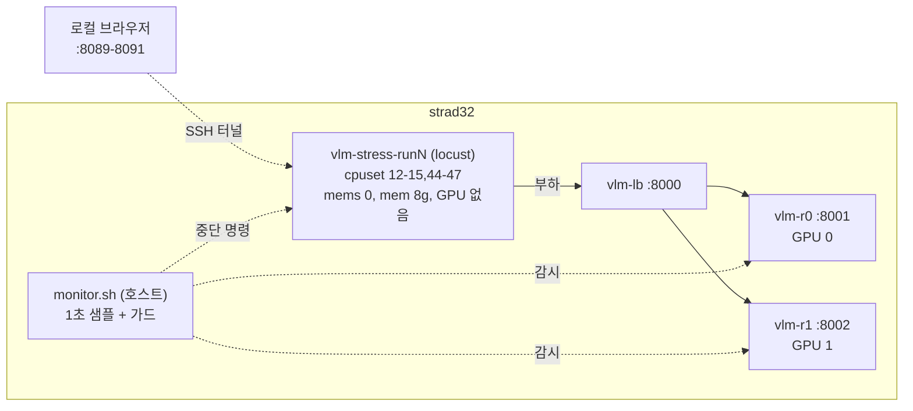

# VLM 서빙 스트레스 테스트 설계

- 작성: 2026-07-30
- 대상: strad32 공용 서빙 (Qwen3.6-35B-A3B NVFP4, DP=2, LB `:8000`)
- 관련: [04 현재 가동 상태](../../04-gpu-pinning-and-serving.md), [08 플래그 스택](../../08-optimization-catalog.md), [05 자원 분할](../../05-strad32-team-resource-split.md)

## 1. 목적

가동한 서빙이 동시 요청을 얼마나 받아낼 수 있는지, 동시성에 따라 처리 속도가 어떻게 변하는지 실측한다. 산출물은 dst와 dmt에 안내할 권고 동시성 한 줄과, 확장 판단(DP=4 승격) 근거다.

측정 목표 네 가지:

1. 포화점(knee): 동시성을 올려도 처리량이 더 늘지 않는 지점
2. 동시성별 지연 곡선: TTFT, TPOT, p95
3. 파괴점: 에러와 타임아웃이 시작되는 지점
4. DP=2 확장 효율: 레플리카 1개 대비 2개의 처리량 배수

## 2. 최상위 제약: 타 팀 자원 무침범

이 테스트의 1순위 요건은 타 팀(vpt, dpt)에 침범도 영향도 주지 않는 것이다. 성능 수치보다 우선한다.

직접 경로는 플래그로 차단하고, 간접 경로는 감시로 차단한다.

| 자원 | 조치 |
|---|---|
| CPU | 부하기 컨테이너 `--cpuset-cpus=12-15,44-47` (배정 0-15,32-47 의 부분집합) |
| NUMA | `--cpuset-mems=0` |
| RAM | 컨테이너당 `--memory=8g --memory-swap=8g`. 총합 64+64+2+8×N 을 몫 225g 이하로 유지 |
| GPU | `--gpus` 미지정. 부하기는 GPU를 인식하지 못한다 |
| 포트 | 8089-8093 (dst+dmt 8xxx 규칙) |
| 대상 | `host.docker.internal:8000` 과 `:8001`, `:8002` 만. 타 팀 엔드포인트(9091 등) 미접근 |
| 디스크 | 결과물은 `/data01/dmt/stress-results/` 만 |

간접 경로는 감시 대상이다. 우리 카드 2장이 450W 캡 상태로 지속 부하를 받으면 섀시 흡기 온도가 올라 타 팀 카드가 throttle될 수 있다. 벽전력은 8장 전부 450W 캡이 걸려 있어 구조적으로 안전하다(05 공유 자원 규칙).

자동 중단 트리거:

| 트리거 | 임계 | 근거 |
|---|---|---|
| 타 팀 GPU(4-7) 온도 | 83도 초과 | 열 결합으로 타 팀 카드 throttle |
| 타 팀 GPU(4-7) SM 클럭 | 시작 대비 15퍼센트 이상 하락이 30초 지속 | throttle 실발생 신호 |
| NUMA node 0 여유 메모리 | 8 GiB 미만 | 우리 구역 압박 |
| load average (1분) | 96 초과 (코어 64의 1.5배) | 서버 전반 |
| LB 5xx 비율 | 20퍼센트 초과가 30초 지속 | 공용 서비스이므로 dst 영향. `vlm-lb` access log의 최근 30초 status 코드로 집계한다. 클라이언트 타임아웃은 5xx를 만들지 않으므로 파괴점 측정과 충돌하지 않는다 |

중단은 Locust REST API `POST /stop` 으로 수행하고, 발동 이유를 결과 디렉토리에 기록한다.

## 3. 아키텍처



감시 프로세스는 부하기와 분리한다. 부하기가 죽어도 감시와 중단 권한이 남아야 한다.

Locust 컨테이너는 테스트 종료 후에도 내리지 않는다. 런별로 컨테이너와 포트를 분리하여 세 런의 Web UI를 모두 남긴다. 컨테이너가 살아 있는 동안 monitor는 대기 상태로 유지되며, Web UI에서 수동으로 재실행해도 가드가 작동한다.

## 4. 워크로드

시나리오 3종을 가중치로 혼합한다.

| 시나리오 | 비중 | 입력 | 이미지 토큰 |
|---|---|---|---|
| S1 텍스트 | 20퍼센트 | 없음 | 0 |
| S2 이미지 1MP | 50퍼센트 | 합성 1024x1024 | 약 1.0K |
| S3 이미지 native | 30퍼센트 | 합성 4464x2160 | 약 9.4K |

프롬프트는 inspection 판정용 JSON 요청을 사용한다(examples/prompts.md 2번 기반).

- 출력은 `max_tokens=256` 과 `ignore_eos=true` 로 고정한다. decode 길이가 요청마다 흔들리면 동시성별 지연 비교가 성립하지 않는다. 실제 워크로드 근사는 `IGNORE_EOS=0` 으로 별도 실행한다
- `enable_thinking=false` (배치 전제)
- 이미지는 동일 파일을 재사용한다. prefix cache와 mm-processor cache가 모두 비활성이므로 동일 이미지에도 캐시 특혜가 없다. 현실적 최악 케이스에 해당한다
- `response_format` json_schema는 기본 비활성이다. xgrammar 컴파일 비용이 섞이면 순수 서빙 한계가 흐려진다. `USE_SCHEMA=1` 로 별도 실행한다
- 이미지는 `examples/make_sample.py` 를 재사용한 합성 이미지다. 실 svnet3 프레임은 반입하지 않는다. 부하 특성은 픽셀 수가 결정하므로 합성으로 충분하며, 판독 정확도는 이 테스트의 관심사가 아니다

ramp는 계단식이다.

```
동시 사용자: 1, 2, 4, 8, 12, 16, 24, 32, 48, 64
단계당 90초 (앞 30초는 워밍으로 버리고 뒤 60초를 측정 구간으로 사용)
사전 워밍 5요청으로 첫 요청 JIT 컴파일을 배제
```

1차 변곡은 16 근처를 예상한다. `--max-num-seqs 16` 이 엔진 상한이므로 레플리카당 running이 16에서 캡되고 나머지는 waiting으로 밀린다. DP=2이므로 합계 32이며, 그 위는 큐 지연만 늘어나는 구간이다.

런 구성:

| 런 | 포트 | 대상 | 구성 | 소요 |
|---|---|---|---|---|
| run1 | 8089 | LB `:8000` | 혼합, 전 단계. knee, 지연 곡선, 파괴점 | 15분 |
| run2 | 8090 | 레플리카 `:8001` 직결 | 혼합, 32까지. DP=2 확장 효율 | 11분 |
| run3a | 8091 | LB `:8000` | S1 단독, 동시 8과 16 | 3분 |
| run3b | 8092 | LB `:8000` | S2 단독, 동시 8과 16 | 3분 |
| run3c | 8093 | LB `:8000` | S3 단독, 동시 8과 16 | 3분 |

run3을 시나리오별 컨테이너로 분리하는 이유는 세 결과의 Web UI를 모두 남기기 위함이다. 컨테이너 5개의 RAM 상한 합은 40g이며, 서빙 130g을 더해도 몫 225g 이내다.

run2 진행 중 r1이 dst 트래픽을 받으면 비교가 흔들린다. dst 트래픽을 차단하지는 않으며(공용 서비스의 우선순위가 측정보다 높다), monitor가 r1의 요청 수를 함께 기록하여 사후에 확인한다.

실패 정의: HTTP 200 아님, TTFT 60초 초과, 전체 300초 초과.

## 5. 측정 지표

클라이언트 측(Locust):

| 지표 | 방법 |
|---|---|
| TTFT | SSE 첫 청크 도착 시각. 시나리오별 커스텀 이벤트 `TTFT-S1/S2/S3` |
| 전체 지연 | 마지막 청크까지. `total-S1/S2/S3` |
| TPOT | `(전체 - TTFT) / (completion_tokens - 1)` |
| 출력 처리량 | `stream_options.include_usage=true` 의 completion_tokens 합 / 측정 구간. 커스텀 이벤트의 `response_length` 에 토큰 수를 실어 Locust 집계를 그대로 활용한다 |
| 실패율 | 위 실패 정의 |

엔진 측(레플리카별 `/metrics`, 1초 샘플):

| 지표 | 읽는 이유 |
|---|---|
| `num_requests_running`, `num_requests_waiting` | 바쁜 이유가 처리 중인지 큐잉인지 구분 |
| `num_requests_waiting_by_reason{capacity,deferred}` | 큐잉 원인이 KV 부족인지 스케줄러인지 |
| `gpu_cache_usage_perc` | KV 3.14 GiB 포화도 |
| `num_preemptions_total` | KV 압박의 직접 증거. 증가 시작 동시성이 실질 상한 |
| `request_queue_time_seconds` | 큐 대기 시간 |
| `time_to_first_token_seconds` | 서버 관점 TTFT. 클라이언트 측정과 대조하여 부하기 오버헤드를 검출 |
| `request_success_total` | 레플리카 간 분배 균형 |

시스템 측(호스트, 1초 샘플): GPU 8장 전부의 util, mem, power, temp, clocks.sm, load average, NUMA node별 여유 메모리, 컨테이너 CPU 사용률.

## 6. 산출물

`/data01/dmt/stress-results/<타임스탬프>-<런이름>/`

| 파일 | 내용 |
|---|---|
| `locust_stats.csv`, `locust_stats_history.csv`, `locust_failures.csv` | Locust `--csv --csv-full-history` |
| `report.html` | Locust HTML 리포트 |
| `engine.csv` | 레플리카별 엔진 지표 1초 샘플 |
| `system.csv` | GPU 8장, load average, NUMA 여유 1초 샘플 |
| `guard.log` | 가드 판정 이력과 발동 이유 |
| `meta.json` | 이미지 태그, vLLM 플래그 스냅샷, 대상, 시각, 타 팀 컨테이너 스냅샷 |
| `summary.md` | 아래 판정 규칙 적용 결과 |

`summary.md` 판정 규칙:

| 항목 | 정의 |
|---|---|
| knee | 출력 처리량 증가율이 10퍼센트 미만이면서 p95 지연이 전 단계 대비 1.5배를 초과하는 첫 단계. 한 조건만 충족하면 후보로 표기 |
| 파괴점 | 실패율 1퍼센트를 초과하는 첫 단계 |
| 실질 상한 | `num_preemptions_total` 이 증가하기 시작하는 첫 단계 |
| DP 효율 | run1 최대 처리량 / run2 최대 처리량 |
| 무침범 증빙 | 타 팀 GPU 최고 온도와 클럭 변화폭, load average 최대, node 0 최소 여유, 가드 발동 여부 |

마지막에 권고 동시성을 낸다. 기준은 knee의 70퍼센트이며, 파괴점과 실질 상한 중 더 낮은 값이 knee보다 앞서면 그 값을 기준으로 삼는다.

## 7. 컴포넌트

```
stress/
  README.md         실행 절차, SSH 터널, 결과 위치
  locustfile.py     시나리오 3종. 요청 1건의 전송과 계측만 담당
  shapes.py         시간에 따른 동시성만 담당. 요청 내용을 모른다
  make_assets.py    examples/make_sample.py 를 재사용해 1MP와 native 이미지 생성 (로컬 실행)
  run.sh            오케스트레이션, 몫 preflight, 결과 수집
  monitor.sh        관측과 자동 중단만 담당. 부하기 내부를 모른다
  analyze.py        CSV 입력, summary.md 출력. 단독 재실행 가능
```

경계를 이렇게 나눈 이유는 부하 형태(shapes)와 부하 내용(locustfile)과 감시(monitor)가 서로를 몰라야 하나를 바꿀 때 나머지를 건드리지 않기 때문이다.

인터페이스 계약:

| 경계 | 계약 |
|---|---|
| run.sh에서 컨테이너로 | 환경변수 `TARGET_HOST`, `IGNORE_EOS`, `USE_SCHEMA`, `STAGES`, `STAGE_SEC`, `SCENARIOS` |
| monitor.sh에서 부하기로 | `POST http://localhost:<포트>/stop` 만 사용 |
| monitor.sh와 locust에서 analyze.py로 | CSV 컬럼 스키마 고정 |

서버에는 pip이 없으므로 `analyze.py` 와 `monitor.sh` 는 표준 라이브러리와 기본 유틸리티만 사용한다. `make_assets.py` 는 Pillow가 필요하므로 로컬에서 실행하고 결과 이미지를 서버로 복사한다.

## 8. 에러 처리

| 상황 | 처리 |
|---|---|
| 요청 실패 | Locust failure로 집계하고 계속. 중단 판단은 가드만 수행 |
| 가드 발동 | Locust `/stop` 호출, 컨테이너는 유지하여 CSV 보존, 이유를 `guard.log` 와 `meta.json` 에 기록 |
| monitor 사망 | run.sh의 watchdog이 감지하여 즉시 Locust를 중단한다. 감시 없는 부하는 허용하지 않는다 |
| SSH 세션 종료 | 컨테이너와 monitor는 nohup으로 생존. shape 종료와 `--run-time` 이중으로 무한 부하를 차단 |
| 결과 디렉토리 쓰기 실패 | preflight에서 검출하고 시작하지 않는다 |

## 9. 검증 순서

본 측정 전에 세 단계를 통과해야 한다.

1. `run.sh preflight`: cpuset이 배정의 부분집합인지, RAM 총합이 몫 이하인지, `--gpus` 미지정인지, 포트가 8xxx인지, 대상이 우리 엔드포인트인지 확인
2. 가드 단독 테스트: 임계를 의도적으로 낮추어(`GUARD_LOADAVG=0.1`) 자동 중단이 실제로 걸리는지 확인한다. 부하를 걸기 전에 브레이크가 듣는 것을 증명한다
3. smoke: 동시 1, 60초. CSV 4종 생성과 `analyze.py` 통과 확인

이후 run1, run2, run3을 순차 실행한다. 사후에 타 팀 GPU 온도와 클럭 기록으로 무침범을 확인하고, LB 5xx로 dst 영향을 확인한다.

## 10. 레포 반영

`stress/` 를 커밋한다. `stress/assets/` 는 native 이미지가 수 MB이므로 gitignore하고 스크립트로 생성한다. 결과물은 서버 `/data01/dmt/` 에만 둔다.
